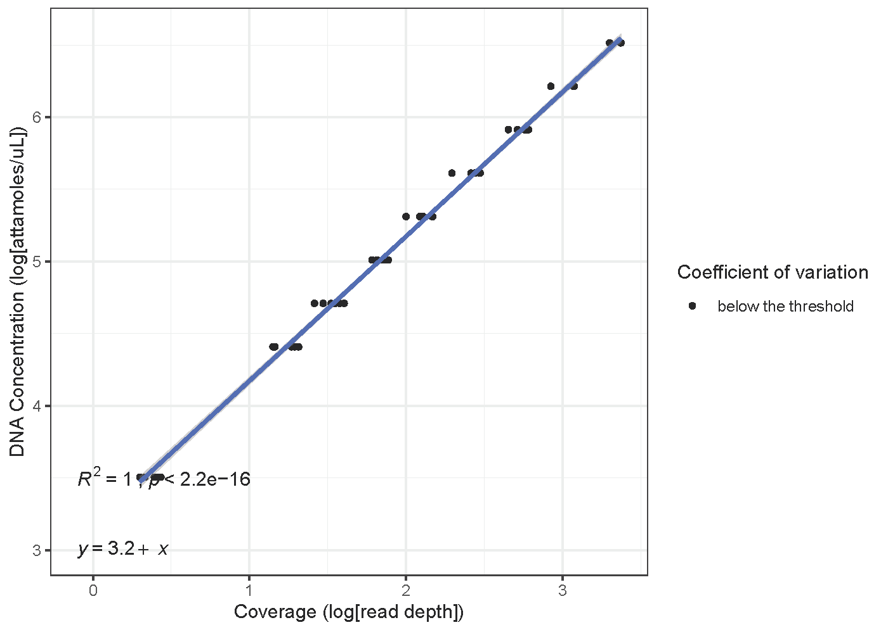
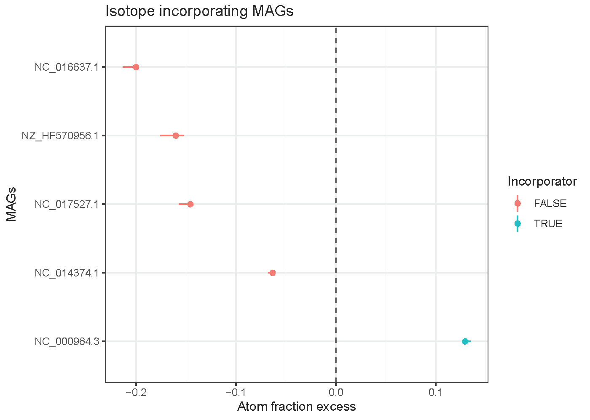
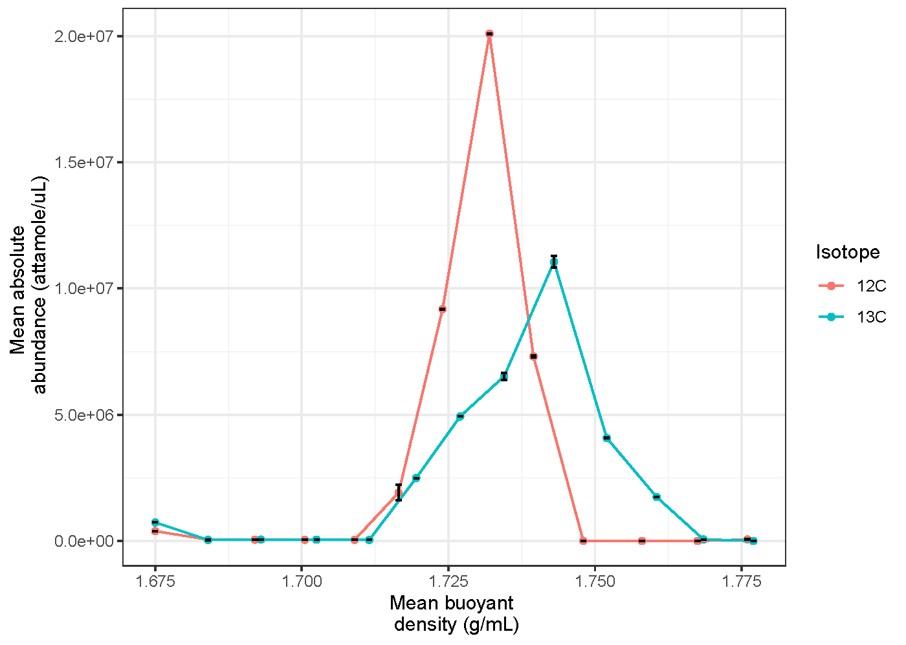

# qsipR package tutorial

qsipR is a statistical analysis package to identify isotope incorporating MAGs using the principles of quantitative stable isotope probing (qSIP).

Statistical analysis to identify a stable isotope incorporating taxa obtained as metagenome-assembled genomes (MAGs). Scaled absolute abundances are utilized which are obtained from relative abundance of MAGs and sequins (spike-ins) of known concentration over a range of coverages. Using absolute abundances and bootstrapping, atom fraction excess of MAGs is estimated, and thereby, incorporators of a stable isotope are identified. Please refer [Hungate et al. (2015)](doi:10.1128/AEM.02280-15) for details on quantitative stable isotope probing. Additionally, the bouyant density plots for stable isotope incorporating MAGs will also be provided.

This tutorial will provide installation help, examples, and mock output plots.

## Installation

load package using 

```
library(qsipR)
```

## Examples

### Obtaining scaled absolute abundances

Scale feature (contig/MAG) coverage values to estimate their absolute abundance in molarity, or similar units. Scaling is done using coverage values of sequins (or spike-ins) that are added at a defined concentration to the density gradient fractions. This step is the foundation for qSIP analysis.

```
scale_features(f_tibble, sequin_meta, seq_dilution, log_trans, coe_of_variation)
```

 - f_tibble Can be either of
 (1) a tibble with first column "Feature" that contains bin IDs, and the rest of the columns represent samples with bins' pooled values. Every sequin is also listed s a feature.
 (2) a tibble as outputted by the program "checkm coverage" from the tool [CheckM](https://github.com/Ecogenomics/CheckM). If this is the input format, the optional function, `pool_bin_stat` must be run. `pool_bin_stat` parses the CheckM coverage output to provide a tibble as described in option 1. Please check `pooling_functions.R` for further details. Please check [CheckM documentation](https://github.com/Ecogenomics/CheckM) on the usage for "checkm coverage" program
 
A sample coverage metadata file is shown below:
 
``` {r, echo = F, warning=FALSE}
 f_tibble <- readr::read_csv("mock_input_data/coverage_metadata.csv")
 head(f_tibble)
```

- sequin_meta tibble containing sequin names ("Feature column") and concentrations in attamoles/uL ("Concentration") column. A sample sequin file is shown below:

```{r, echo = F, warning = FALSE}
sequin_meta <- readr::read_csv("mock_input_data/sequins_metadata.csv")
 head(sequin_meta)
```

- seq_dilution tibble with first column "Sample" with *same sample names as in f_tibble*, and a second column "Dilution" showing ratio of sequins added to final sample volume (e.g. a value of 0.01 for a dilution of 1 volume sequin to 99 volumes sample). A sample sequin dilution file is shown below:

```{r, echo = F, warning = F}
seq_dilution <- readr::read_csv("mock_input_data/dilutions_data.csv")
 head(seq_dilution)
```

- log_trans Boolean (TRUE or FALSE), should coverages and sequin concentrations be log-scaled?
- coe_of_variation Acceptable coefficient of variation for coverage and detection (eg. 20 - for 20 % threshold of coefficient of variation). Coverages above the threshold value will be flagged in the plots.

Regression plots will be saved into a folder `sequin_scaling_plots`. A sample plot is provided below. 

```{r, fig.cap=c("Sequin scaling regression plot"), echo = F, warning = F, fig.width=15, fig.height=12, fig.align='center'}

```

## Calculate atom fraction excess

Atom fraction excess (AFE) provides a statistical measure to whether a stable isotope was incorporated by the taxa. See [Hungate et al. (2015)](doi:10.1128/AEM.02280-15) for more details.

```
calc_atom_excess_MAGs(Mlab, Mlight, Mheavymax, isotope)
```

- physeq:  A phyloseq object
- control_expr:  Expression used to identify control samples based on sample_data.
- treatment_rep:  Which column in the phyloseq sample data designates replicate treatments
- isotope  The isotope for which the DNA is labeled with ('13C' or '18O')
- df_OTU_W:  Keep NULL
- Gi: GC content. A sample GC content file is shown below:

```{r, echo = F, warning=F}
GC_content = readr::read_csv("mock_input_data/GC_content.csv")
head(GC_content)
```

## Additional files required for analysis

### Fractions metadata
A fractions file as a comma separated file (.csv file) with the following columns: \n

  -Replicate: Depends on how many replicates the study has \n
  
  -Fractions: Typically in the range of 1-24 \n
  
  -Buoyant_density: As calculated from the refractometer for each fraction and replicate \n
  
  -Isotope - "12C", "13C", "14N", "15N" etc. \n
  
  -DNA_concentration \n
  
  -Sample - In the format "'isotope'\_rep\_#\_fraction\_#". For instance 12C\_rep\_1\_fraction\_1 \n

A sample file is shown below:

```{r, echo = F, warning=F}
fractions = readr::read_csv("mock_input_data/fractions.csv")
head(fractions)
```

### GTDB style taxonomy data
A taxonomy file in the GTDB output format (.tsv format). Load the bacteria and archaea taxonomy outputs separately. The markdown requires loading the standard output files from GTDB-Tk separately for bacteria and archaea

## Calculate bootstrap confidence intervals for AFE using qSIP

Calculate bootstrap confidence intervals (CI) for atom fraction excess using q-SIP method using the HTSSIP package

## Further steps

Use `ggplot2` package Plot AFE CI for each taxa to identify incoporators. A sample AFE plot is shown below:

```{r, fig.cap=c("Atom fraction excess with bootstrapped confidence intervals to identify incorporators. Aqua color indicates an incorporator, which has an AFE > 0"), echo = F, warning = F, fig.width=15, fig.height=12, fig.align='center'}

```

A list of incorporators can also be obtained using the following function

```
incorporators_taxonomy(taxonomy, bootstrapped_AFE_table)
```

`qsipR` also provides a function to visualize the absolute abundance of a taxa across the buoyant density gradient. A sample plot is shown below.

```{r, fig.cap=c("mean absolute abundance of 12C (red) and 13C (aqua) fractions of interested taxa across buoyant density gradient"),echo = F, warning = F}

```

